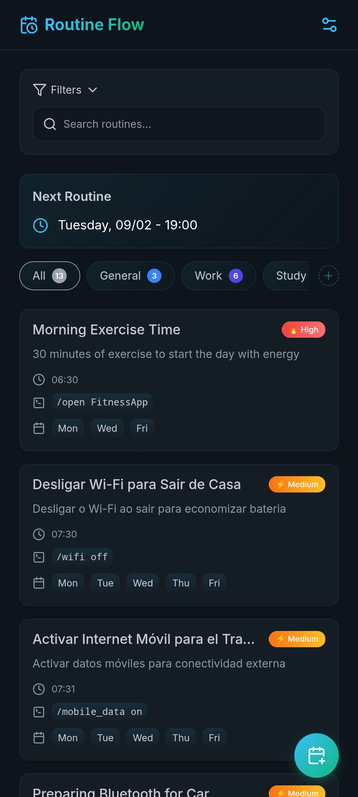

<table align="right">
  <tr>
    <td height="43px">
      <b>
        <a href="README.pt.md">Português 🇧🇷</a>
      </b>
    </td>
  </tr>
</table>

# Routine Flow


[](https://tasker.joaoapps.com/)

Routine Flow is a routine manager that allows you to create automated routines that perform specific actions at scheduled times and on specific days of the week - from opening apps and toggling Wi-Fi to executing complex custom commands. It's ideal for optimizing productivity and building consistent habits through automation.



## Table of Contents

- [Features](#features)
- [Installation](#installation)
  - [1. Clone the repository](#1-clone-the-repository)
  - [2. Running the application](#2-running-the-application)
  - [3. Tasker Integration](#3-tasker-integration)
- [Custom Commands](#custom-commands)
  - [Available Commands](#available-commands)
  - [Adding Custom Commands in Tasker](#adding-custom-commands-in-tasker)
- [Configuration](#configuration)
  - [Notifications](#notifications)
  - [Supported Languages](#supported-languages)
- [Project Structure](#project-structure)
  - [Data Structure](#data-structure)
  - [Folder and File Structure](#folder-and-file-structure)
- [Tasker Integration](#tasker-integration-1)
  - [Automation System](#automation-system)
- [Technologies Used](#technologies-used)

## Features

- **Routine Management**: Create, edit, and delete custom routines
- **Smart Scheduling**: Set execution times and days of the week
- **Organization with Categories**: Group routines into custom categories with customizable colors and names
- **Priority System**: Define and view priorities (low, medium, high) with visual indicators
- **Custom Commands**: Execute actions like opening apps, locking the screen, and controlling connectivity
- **Advanced Filters**: Filter routines by text, status, priority, day of the week, and command
- **Chronological Sorting**: Organized view by activation time
- **Next Routine**: Display of the next scheduled routine
- **Customizable Notifications**: Configure voice announcements, toast notifications, and vibration
- **Multi-language**: Full support for Portuguese, English, and Spanish

## Installation

### 1. Clone the repository

```bash
git clone https://github.com/x-mrrobot/routine-flow.git
cd routine-flow
```

### 2. Running the application

**Option A: Directly in the browser**

- Open the `index.html` file directly in your browser

**Option B: Local server using live-server**

```bash
# Install live-server globally
npm install -g live-server

# Run on port 5000
live-server --port=5000
```

### 3. Tasker Integration

- Make sure [Tasker](https://play.google.com/store/apps/details?id=net.dinglisch.android.taskerm) is installed
- Import this project from [TaskerNet](https://taskernet.com/shares/?user=AS35m8k%2FEQCE%2BJiPvkN1cJcjBE7Yh%2B%2Fa8zZeifxINYS7E94XnS26HrYYgsweBVnbf2VB9WJdrS5k&id=Project%3AROUTINE+FLOW)
- To run most of the available commands, you need to enable [ADB WiFi](https://tasker.joaoapps.com/userguide/en/help/ah_adb_wifi.html)

## Custom Commands

Routine Flow supports a set of standardized commands. When a routine is triggered, the command defined in the routine is executed in Tasker through the **RF 04 - COMMAND EXECUTOR** task.

### Available Commands

| Command                 | Description                  | Example            |
| ----------------------- | ---------------------------- | ------------------ |
| `/open [app]`           | Open a specific application  | `/open Telegram`   |
| `/close [app]`          | Close a specific application | `/close Youtube`   |
| `/wifi [on/off]`        | Turn Wi-Fi on/off            | `/wifi on`         |
| `/mobile_data [on/off]` | Control mobile data          | `/mobile_data off` |
| `/bluetooth [on/off]`   | Turn Bluetooth on/off        | `/bluetooth on`    |
| `/airplane [on/off]`    | Control airplane mode        | `/airplane off`    |
| `/lockscreen`           | Lock the device screen       | `/lockscreen`      |
| `/run_task [task]`      | Execute a custom task        | `/run_task MyTask` |

### Adding Custom Commands in Tasker

To add new commands, edit the **RF 04 - COMMAND EXECUTOR** task by adding a new conditional:

```
Else If %routine_command ~ "/your_command"
  [Action]
End If
```

## Categories

Routine Flow allows you to organize your routines into custom categories. Each category can have a name and a color, making it easier to view and manage them.

- **Create and Manage**: In the main menu, click the "+" button next to the categories to open the manager. You can add, edit, and delete categories.
- **Filter by Category**: Click on a category to display only the routines associated with it.
- **Default Category**: There is a default "General" category that cannot be removed.

## Configuration

### Notifications

Access the settings button in the upper right corner to customize:

- **Announce with Google voice**: Enables voice announcements of routine titles
- **Show toast on screen**: Displays floating notifications with routine titles
- **Vibrate device**: Vibrates when routines are executed

### Supported Languages

- **pt.json**: Portuguese (Brazil)
- **en.json**: English (United States)
- **es.json**: Spanish

## Project Structure

### Data Structure

Routines are stored in JSON format:

```json
{
  "id": 1234567890,
  "title": "Morning exercises",
  "description": "30 minutes of exercise to start the day",
  "command": "/open FitnessApp",
  "priority": "high",
  "time": 21600, // seconds since 00:00 (6:00 AM)
  "frequency": [1, 3, 5], // Mon, Wed, Fri (0-6 = Sun-Sat)
  "active": true,
  "categoryId": "health"
}
```

### Folder and File Structure

The project's file structure is organized as follows:

```
routine-flow/
├── index.html
├── README.md
└── src/
    ├── App.js
    ├── assets/
    │   ├── icons/
    │   └── styles/
    ├── components/
    │   ├── Modal.js
    │   └── Toast.js
    ├── features/
    │   ├── categories/
    │   │   ├── components/
    │   │   │   ├── CategoryForm.js
    │   │   │   ├── CategoryModal.js
    │   │   │   └── CategoryRenderer.js
    │   │   ├── data/
    │   │   │   └── categories.js
    │   │   └── services/
    │   │       └── CategoryService.js
    │   ├── routine/
    │   │   ├── components/
    │   │   │   ├── AppPickerModal.js
    │   │   │   ├── CommandDropdown.js
    │   │   │   ├── DeleteRoutineModal.js
    │   │   │   ├── RoutineForm.js
    │   │   │   ├── RoutineModal.js
    │   │   │   ├── RoutineRenderer.js
    │   │   │   └── TaskPickerModal.js
    │   │   ├── data/
    │   │   │   ├── apps.js
    │   │   │   ├── routines.js
    │   │   │   └── tasks.js
    │   │   └── services/
    │   │       ├── RoutineActions.js
    │   │       ├── RoutineFilter.js
    │   │       └── RoutineService.js
    │   └── settings/
    │       ├── SettingsModal.js
    │       └── SettingsService.js
    ├── locales/
    │   ├── en.json
    │   ├── es.json
    │   └── pt.json
    ├── services/
    │   ├── EnvironmentManager.js
    │   ├── EventBus.js
    │   ├── I18n.js
    │   ├── Icons.js
    │   ├── PaginationManager.js
    │   └── TimeService.js
    └── shared/
        ├── DOM.js
        └── Utils.js
```

## Tasker Integration

### Automation System

Routine Flow was specifically developed to run on Tasker, using:

1.  **Automatic Execution**: Tasker monitors the times, days of the week, and executes scheduled routines
2.  **Command System**: Commands are processed by the **RF 04 - COMMAND EXECUTOR** task, through the `%routine_command` variable which receives the routine's command
3.  **Integrated Notifications**: Notification system according to user settings

## Technologies Used

- **Frontend**: HTML5, CSS3, JavaScript (Module Pattern IIFE for better compatibility across Tasker's WebViews)
- **Storage**: localStorage for data persistence
- **Internationalization**: Custom i18n system with JSON files
- **EnvironmentManager**: Module for environment management (web or Tasker) that abstracts platform-specific functionalities like data storage and loading.
- **EventBus**: Event publishing/subscribing system for decoupled communication between different application modules.
- **Icons**: Custom set of SVG icons
- **Tasker**: Full integration (backend)